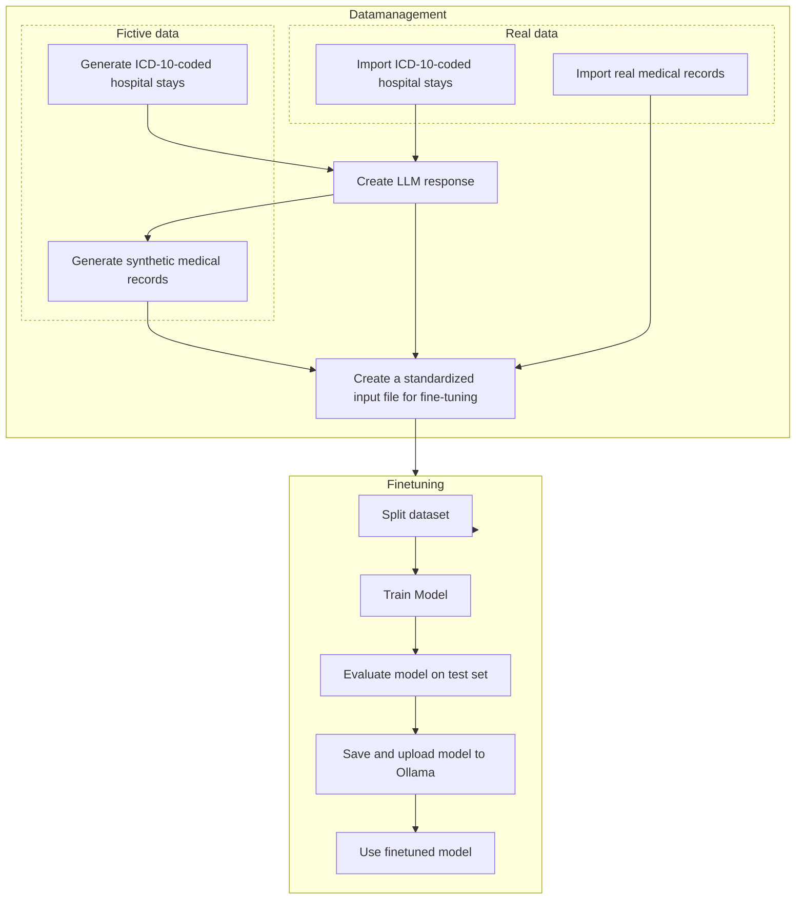

# Stream

Stream is a modular pipeline designed to generate synthetic or use real hospital data, format it for instruction tuning, and fine-tune a large language model (LLM) using this data.

---

> ⚠️ **IMPORTANT — NVIDIA GPU & CUDA Required** ⚠️  
>
> This project **requires an NVIDIA GPU** and a **properly installed CUDA toolkit**.  
> Make sure your system has compatible GPU drivers and the correct version of CUDA installed **before running anything**.  
>
> 🔧 See the [official CUDA installation guide](https://developer.nvidia.com/cuda-downloads) for setup instructions.

---

## 🧠 Workflow Overview


---

## 🚀 Getting started

### 📦 Project Structure

```markdown
├── .gitignore
├── outputs
│   └── best_models
├── pyproject.toml
├── .python-version
├── README.md
└── stream
    ├── cli.py
    ├── config
    │   ├── config.py
    │   ├── config.yaml
    │   └── stream_config.yaml
    ├── dataset.py
    ├── export.py
    ├── finetunning.py
    ├── generate.py
    ├── inference.py
    ├── __init__.py
    ├── __main__.py
    ├── prompt.yaml
    └── referentials
        └── cim_10_atih_2019.tsv
```

### 📥 Install the dependencies

```bash
uv venv
source .venv/bin/activate
uv pip install .
```
> ⚠️ Note : During the developpement of the projet, uv was used as the main Python package manager. Pip can also be used.

### ✏️ Set-up connection to Ollama server

Create a configuration file at `stream/config/config.yaml`:

```bash
cd stream/stream/config
touch config.yaml
vim config.yaml
```

Paste the following example settings (replace placeholders with real values):

```yaml
ollama:
  host: "host_to_your_ollama_server"
  model: "your_ollama_model_for_data_generation"
```

> 💡 **Tip:** You can specify a default HuggingFace model for fine-tuning.

---

### ✏️ Set-up configuration file

The `stream/config/stream_config.yaml` file is setting up all the parameters for the llm finetuning and data generation.

> 🔧 You can adjust the parameters as you want for your project.

Here an example of `stream_config.yaml` file.
```yaml
path:
  pmsi_dataset: "path/to/pmsi_dataset.csv"
  train_dataset: "path/to/train_dataset.csv"
  gguf_path: "path/to/gguf/model/will/be/saved"

llm:
  epoch: 3
  batch_size: 8
  lr: 2e-4
  best_model_path: "path/to/best/model/folder"
  r: 8
  lora_alpha: 16

hf:
  model: "unsloth/the_model_i_want_to_finetune"
```

> 💡 The `pmsi_dataset.csv` file has the following schema :
> ```python
> schema={
>             "visit_occurence_id": polars.Int64,
>             "los": polars.Int32, # length of stay
>             "condition_status_source_value": polars.String, # DP, DR, DAS
>             "concept_code": polars.String, # ICD-10 code
>             "concept_name": polars.String, # ICD-10 label
>         }
> ```

> 💡 The `train_dataset.csv` file has the following schema :
> ```python
> schema={
>                 "visit_occurence_id": polars.Int64,
>                 "instruction": polars.String,
>                 "input": polars.String,
>                 "output": polars.String,
>                 "text": polars.String,
>             }
> ```

---

## 🧬 Data Generation

### 💻 With CLI
To generate synthetic medical records for training:

```bash
uuv run -m stream generate --r --n 10
```
The `generate` is used to generate synthetic medical records.
- Use `--r` for real ICD-10 codes.
- Use `--f` for fake ICD-10 codes.  

The `--n` is used to specify how many data you want to generate.

### 🐍 With Python

```python
from stream.generate import generate_MR
generate_MR(fictive=True, n=10) # fictive=False to generate fictive ICD-10 values
```

---

## 🔁 Fine-Tuning


### 💻 Run with CLI
- To train the model mentionned in the `config.yaml` file :
```bash
uv run -m stream llm --train
```
> 💡 The train file is the one mentionned in the `stream_config.yaml`.

> 💡 The dataset will be splited automaticaly during training : train (60%), validation (20%), test (20%).

- To evalue the model on the test set :
```bash
uv run -m stream llm --test
```
> 💡 The test set is a split of `train_dataset.csv` file, not included during training.

### 🐍 Run with Python

This is the python code to use the module for any model finetuning : 
```python
from stream.finetunning import Cim10Trainer
from stream.dataset import UnslothDatasetBuilder

cim = Cim10Trainer()
# Create and split the dataset
pl_dataset = cim.dataset
dataset_builder = UnslothDatasetBuilder(cim.tokenizer)
dataset = dataset_builder.build_dataset(pl_dataset)
dataset = dataset.map(dataset_builder.formatting_prompts_func, batched=True)
splits = dataset_builder.split_dataset(dataset)
train = splits["train"]
val = splits["validation"]

# set and finetune the model
cim.set_model()
cim.finetune_model(train=train, val=val)

```
This is the python code to use the module for any model evalutaion : 
```python
from stream.finetunning import Cim10Trainer
from stream.dataset import UnslothDatasetBuilder

cim = Cim10Trainer()
# Create and split the dataset
pl_dataset = cim.dataset
dataset_builder = UnslothDatasetBuilder(cim.tokenizer)
dataset = dataset_builder.build_dataset(pl_dataset)
dataset = dataset.map(dataset_builder.formatting_prompts_func, batched=True)
splits = dataset_builder.split_dataset(dataset)
test=splits["test"]
# Evaluate the model
cim.evaluate_model(
       best_model_path=cim.llm_setting.llm.best_model_path,
       tokenizer=dataset_builder.tokenizer,
       test_dataset=test,
       dataset_chat_template=dataset_builder.tokenize()
)
```
---

## 🎣 Inference
Once you have trained the model, you might want to use it on real data.
> ⚠️ Note : For the moment, only .txt format for input file is supported. 
### 💻 Run with CLI
```bash
uv run -m stream inference --i path/to/my_MR.txt
```

### 🐍 Run with Python
```python

from stream.inference import Cim10Inference
from stream.dataset import UnslothDatasetBuilder
cim = Cim10Inference()   
inference_data = args.input
with open(inference_data, "r", encoding="utf-8") as f:
    lignes = [ligne.strip() for ligne in f]

df = pl.DataFrame({"conversations": lignes})
text = "\n".join(df["conversations"].to_list())
message = [
    {"role" : "user", "content": text}
]
dataset_builder = UnslothDatasetBuilder(cim.tokenizer)
cim.inference(
            best_model_path=cim.llm_setting.llm.best_model_path,
            tokenizer=dataset_builder.tokenizer,
            inference_data=message,
            dataset_chat_template=dataset_builder.tokenize()
        )
```
---

## 🌐 Export the model to Ollama server

You might want to export you model to your local Ollama server. For this, you have to convert your model to a gguf type model.
Ollama required a Modelfile.
Everything can be created by the two commands bellow :
```bash
uv run stream -m export
ollama create mistral-custom -f ./outputs/best_models/Modelfile
```
Those two command create a model on your current ollama server named "mistral-custom" 

If you want to use directly python :
```python
from stream.export import setup_tokenizer,  export_gguf_model
from stream.finetunning import Cim10Trainer

cim = Cim10Trainer()
tokenizer = setup_tokenizer(cim.model_name)
export_gguf_model(model=cim.model, custom_model_path=cim.gguf_path, tokenizer=tokenizer, gguf_path=cim.gguf_path)
```
> ⚠️ Note : you still need the `ollama create` bash command to upload your gguf model to your ollama server instance.


---

## 👥 Credits

Created by Arthur Lamard and Basile Fuchs MD at CHU Brest  


## 📝 Source
This project is based on : 
[record-with-mistral-finetune from AP-HP](https://github.com/24p11/recode-with-mistral-finetune/tree/main)
